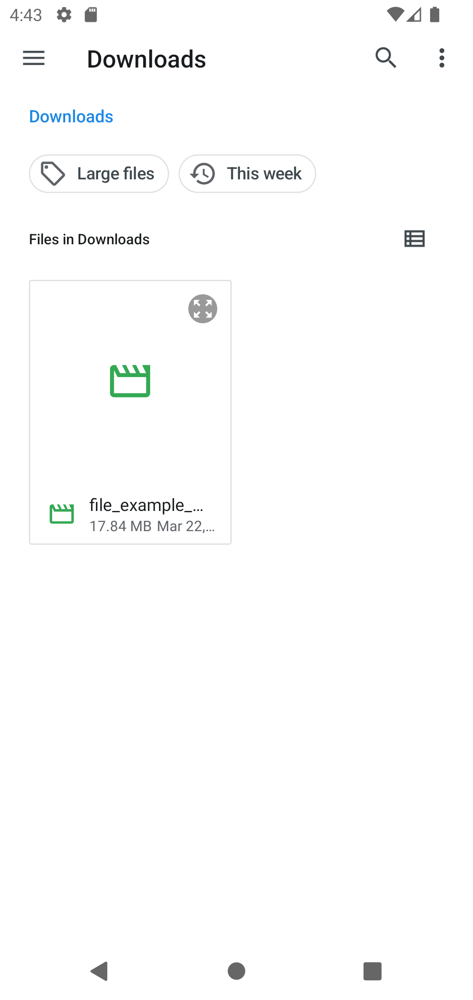
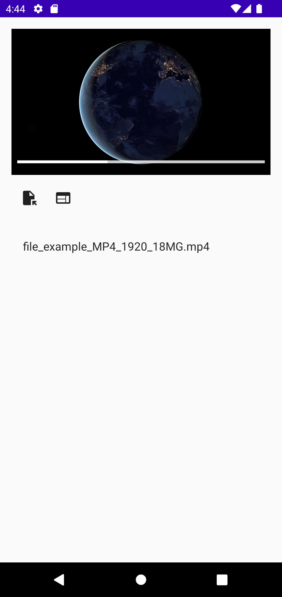
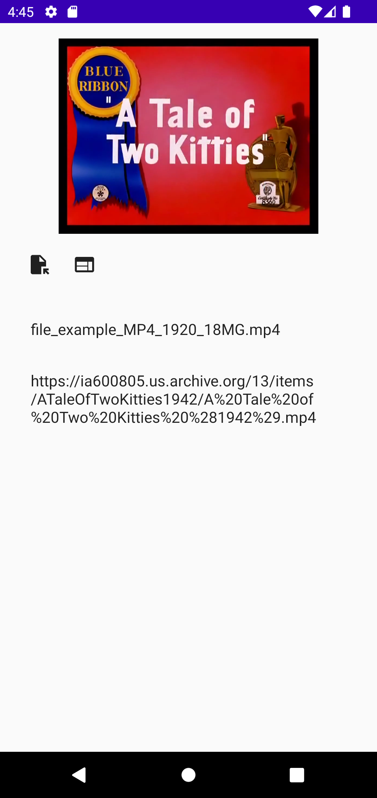

VideoPlayerCompose
===========

An application that demonstrate how to use ExoPlayer lib to play media from local files or a sample link.

A solid app with relevant concepts: 
* ExoPlayer
* Retrieve meta data from media files 
* Jetpack Compose

Getting Started
---------------

For example purpose, this project only support mp4 files and use a certain hard code [media link](https://ia600805.us.archive.org/13/items/ATaleOfTwoKitties1942/A%20Tale%20of%20Two%20Kitties%20%281942%29.mp4)

Screenshots
-----------

